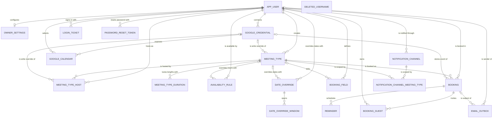

# Entity Model

Reverse-engineered from the Flyway migrations `V1`–`V36` (`src/main/resources/db/migration/`) and the
Panache entities. Every tenant row belongs to exactly one Owner (`owner_id` → `APP_USER.id`); an Owner's
data is never read or written on behalf of another Owner.

Conventions used below: a `String` with Length/Precision `-` is unbounded free text. Times of day are
stored as local wall-clock times and shown as `String` of length 5 (`HH:mm`), because the type vocabulary
has no time-only type. Every `DateTime` is an absolute instant (UTC).

## Entity Relationship Diagram

`DELETED_USERNAME` has no relationships: it records a deleted username without referring to any row.

Deleting an `APP_USER` removes every row that refers to it through `owner_id` or `user_id` — settings, meeting types and their hosts, durations, questions, availability, date overrides, bookings, guests, reminders, Google accounts and calendars, notification channels, queued messages, sign-in tickets and reset tokens — except the queued messages exempted under `EMAIL_OUTBOX.owner_id`.

It also reaches into other Owners' data, because deleting the account deletes its meeting types and everything that refers to a meeting type goes with it (`meeting_type_id` cascades). For each meeting type the deleted Owner created, this removes:

- the Co-hosts' bookings of that type, with their guests, reminders and queued messages. Upcoming ones are cancelled first, so Invitees and guests are notified;
- the Co-hosts' `MEETING_TYPE_HOST` rows for that type;
- the Co-hosts' availability rules and date overrides scoped to that type;
- other Owners' `NOTIFICATION_CHANNEL_MEETING_TYPE` links to that type.

### APP_USER

A login account of the instance; every user is an Owner with their own scheduling page, and some are site administrators.

| Attribute            | Description                                                              | Data Type | Length/Precision | Validation Rules          |
|----------------------|--------------------------------------------------------------------------|-----------|------------------|---------------------------|
| id                   | Unique identifier                                                        | Long      | 19               | Primary Key, Sequence     |
| username             | Lower-case, URL-safe handle; also the path of the Owner's public page    | String    | 64               | Not Null, Unique          |
| password_hash        | One-way protected password; absent for invited accounts not yet activated and for accounts that only sign in externally | String | -             | Optional                  |
| roles                | Effective roles: user, or user and admin when `is_admin` or `oidc_admin` is set | String    | 64               | Not Null, Values: user, user,admin |
| is_admin             | Whether administrator rights were granted locally (setup or a site administrator) | Boolean   | 1                | Not Null                  |
| enabled              | Whether the user may sign in (false = locked)                            | Boolean   | 1                | Not Null                  |
| must_change_password | Whether the user must choose a new password at next sign-in              | Boolean   | 1                | Not Null                  |
| settings_complete    | Whether the user has finished the first-login setup wizard               | Boolean   | 1                | Not Null                  |
| google_sub           | Stable Google account subject used for Google sign-in                    | String    | 255              | Optional                  |
| oidc_sub             | Stable subject from the external identity provider used for sign-in      | String    | 255              | Optional                  |
| oidc_admin           | Whether administrator rights were granted by the external identity provider | Boolean | 1               | Not Null                  |
| created_at           | When the account was created                                             | DateTime  | -                | Not Null                  |

**Constraints:** `google_sub` and `oidc_sub` are each unique when present. `username` is 2–64 characters. An account is shown as pending in the user list while both `password_hash` and `google_sub` are empty; `oidc_sub` is not considered, so a passwordless single sign-on account also shows as pending. The instance always keeps at least one enabled account with `is_admin` set; `oidc_admin` does not count.

### OWNER_SETTINGS

The per-Owner profile and preferences that shape the public page, emails and data retention.

| Attribute                   | Description                                                              | Data Type | Length/Precision | Validation Rules                      |
|-----------------------------|--------------------------------------------------------------------------|-----------|------------------|---------------------------------------|
| id                          | Unique identifier                                                        | Long      | 19               | Primary Key, Sequence                 |
| owner_id                    | Owner these settings belong to                                           | Long      | 19               | Not Null, Foreign Key (APP_USER.id)   |
| owner_name                  | Display name shown to Invitees                                           | String    | 255              | Not Null                              |
| owner_email                 | Address that receives Owner notifications                                | String    | 255              | Not Null, Format: Email               |
| timezone                    | Owner's home time zone (IANA zone id)                                    | String    | 64               | Not Null                              |
| owner_notifications_enabled | Whether the Owner receives booking notification emails                   | Boolean   | 1                | Not Null                              |
| locale                      | Language of the Owner's management pages and emails                      | String    | 8                | Not Null, Values: en, de, he          |
| time_format                 | Clock the Owner prefers on management pages and in the Owner's own emails | String    | 8                | Not Null, Values: auto, h12, h23      |
| booking_retention_days      | Days after a meeting before its Invitee data is erased; empty = instance default | Integer | 10          | Optional                              |
| home_redirect_enabled       | Whether signing in at Home sends the Owner to their dashboard            | Boolean   | 1                | Not Null                              |

**Constraints:** at most one row per Owner (`owner_id` unique). The schema does not require a row: accounts created through `/setup` used to have none, which migration `V24` backfilled. Every account creation path now seeds one. `booking_retention_days` may be empty, meaning the instance default applies; when set it is capped at 36500. `owner_email` may be empty for a freshly created account until setup is completed.

### MEETING_TYPE

A bookable offering published by its Creator: default length, cadence, notice, horizon, location and approval policy.

| Attribute             | Description                                                                | Data Type | Length/Precision | Validation Rules                                     |
|-----------------------|----------------------------------------------------------------------------|-----------|------------------|------------------------------------------------------|
| id                    | Unique identifier                                                          | Long      | 19               | Primary Key, Sequence                                |
| owner_id              | Creator of the meeting type                                                | Long      | 19               | Not Null, Foreign Key (APP_USER.id)                  |
| name                  | Title shown to Invitees                                                    | String    | 255              | Not Null                                             |
| slug                  | URL segment under the Creator's page                                       | String    | 255              | Not Null                                             |
| duration_minutes      | Default meeting length, implicitly one of the allowed durations            | Integer   | 10               | Not Null                                             |
| buffer_before_minutes | Protected time before a meeting for every Host, when neither the Host nor the chosen length sets one | Integer   | 10               | Not Null                                             |
| buffer_after_minutes  | Protected time after a meeting for every Host, when neither the Host nor the chosen length sets one | Integer   | 10               | Not Null                                             |
| description           | Free-text description shown on the booking page                            | String    | -                | Optional                                             |
| active                | Whether the meeting type can currently be booked                           | Boolean   | 1                | Not Null                                             |
| secret                | Whether the meeting type is hidden from the Owner's public listing         | Boolean   | 1                | Not Null                                             |
| min_notice_minutes    | Minimum time between now and the earliest bookable start                   | Integer   | 10               | Not Null                                             |
| horizon_days          | How many days ahead slots are offered                                      | Integer   | 10               | Not Null                                             |
| location_type         | Kind of location                                                           | String    | 16               | Not Null, Values: GOOGLE_MEET, PHONE, IN_PERSON, CUSTOM |
| location_detail       | Phone number, address or custom text for the location                     | String    | -                | Optional                                             |
| requires_approval     | Whether new bookings wait for the Owner's approval                         | Boolean   | 1                | Not Null                                             |
| slot_interval_minutes | Cadence between slot starts; empty = derived from the shortest duration    | Integer   | 10               | Optional                                             |
| google_calendar_id    | Write override: calendar that receives this type's Google events           | String    | -                | Optional                                             |
| google_credential_id  | Connected account holding the write-override calendar                      | Long      | 19               | Optional                                             |
| name_mode             | How the Invitee name field is presented                                    | String    | 16               | Not Null, Values: REQUIRED, OPTIONAL, HIDDEN         |
| guests_mode           | How the additional-guests field is presented                               | String    | 16               | Not Null, Values: OPTIONAL, HIDDEN                   |

**Constraints:** `slug` is unique per Owner. The stored type of `guests_mode` would also accept `REQUIRED`, but the system never sets it for guests. `duration_minutes` is greater than 0. `google_credential_id`, when set, refers to `GOOGLE_CREDENTIAL.id` and is cleared when that account is disconnected.

### MEETING_TYPE_DURATION

One allowed length of a meeting type, optionally with its own buffers. The lengths an Invitee may choose are these rows plus the meeting type's own `duration_minutes`, which is always allowed whether or not a row names it (ADR-0003). A row may repeat the default `duration_minutes`; that row adds no new length and exists only to carry buffers for the default length. Deleting it removes those buffers, but the length stays allowed.

| Attribute             | Description                                                    | Data Type | Length/Precision | Validation Rules                        |
|-----------------------|----------------------------------------------------------------|-----------|------------------|-----------------------------------------|
| meeting_type_id       | Meeting type the length belongs to                             | Long      | 19               | Primary Key, Foreign Key (MEETING_TYPE.id) |
| duration_minutes      | Meeting length in minutes                                      | Integer   | 10               | Primary Key, Min: 1                     |
| buffer_before_minutes | Buffer before a meeting of this length; empty = none for this length | Integer   | 10               | Optional                                |
| buffer_after_minutes  | Buffer after a meeting of this length; empty = none for this length  | Integer   | 10               | Optional                                |

**Constraints:** (`meeting_type_id`, `duration_minutes`) is the composite primary key. `duration_minutes` is greater than 0; buffers, when set, are 0 or more.

### MEETING_TYPE_HOST

A Host's membership of a meeting type — the Creator or an invited Co-host — with their consent state and personal buffers.

| Attribute             | Description                                                     | Data Type | Length/Precision | Validation Rules                        |
|-----------------------|-----------------------------------------------------------------|-----------|------------------|-----------------------------------------|
| id                    | Unique identifier                                               | Long      | 19               | Primary Key, Sequence                   |
| meeting_type_id       | Meeting type hosted                                             | Long      | 19               | Not Null, Foreign Key (MEETING_TYPE.id) |
| owner_id              | Owner acting as Host                                            | Long      | 19               | Not Null, Foreign Key (APP_USER.id)     |
| status                | Consent state of the Host                                       | String    | 16               | Not Null, Values: PENDING, ACCEPTED     |
| role                  | Host role                                                       | String    | 16               | Not Null, Values: CREATOR, COHOST       |
| consent_token         | One-time secret for accepting from the invitation email         | String    | 36               | Optional                                |
| buffer_before_minutes | Host's own buffer before; empty = no personal requirement       | Integer   | 10               | Optional                                |
| buffer_after_minutes  | Host's own buffer after; empty = no personal requirement        | Integer   | 10               | Optional                                |
| google_calendar_id    | Calendar chosen by this Host for the type's events; used only while this Host is the organizer | String | -          | Optional                                |
| google_credential_id  | Connected account of that calendar                              | Long      | 19               | Optional                                |
| created_at            | When the Host was added                                         | DateTime  | -                | Not Null                                |
| responded_at          | When the Host accepted                                          | DateTime  | -                | Optional                                |

**Constraints:** an Owner hosts a meeting type at most once (`meeting_type_id`, `owner_id` unique).

### AVAILABILITY_RULE

A weekly working-hours window of an Owner, either global or specific to one meeting type.

| Attribute       | Description                                             | Data Type | Length/Precision | Validation Rules                                                                 |
|-----------------|---------------------------------------------------------|-----------|------------------|----------------------------------------------------------------------------------|
| id              | Unique identifier                                       | Long      | 19               | Primary Key, Sequence                                                            |
| owner_id        | Owner whose hours these are                             | Long      | 19               | Not Null, Foreign Key (APP_USER.id)                                              |
| day_of_week     | Weekday the window applies to                           | String    | 16               | Not Null, Values: MONDAY, TUESDAY, WEDNESDAY, THURSDAY, FRIDAY, SATURDAY, SUNDAY |
| start_time      | Local start of the window                               | String    | 5                | Not Null                                                                         |
| end_time        | Local end of the window                                 | String    | 5                | Not Null                                                                         |
| meeting_type_id | Meeting type the window is limited to; empty = global   | Long      | 19               | Optional                                                                         |

**Constraints:** `end_time` is after `start_time`. `meeting_type_id`, when set, refers to `MEETING_TYPE.id`.

### DATE_OVERRIDE

A specific calendar date on which an Owner's usual weekly hours are replaced — by other windows or by none (day off).

| Attribute       | Description                                            | Data Type | Length/Precision | Validation Rules                    |
|-----------------|--------------------------------------------------------|-----------|------------------|-------------------------------------|
| id              | Unique identifier                                      | Long      | 19               | Primary Key, Sequence               |
| owner_id        | Owner the override belongs to                          | Long      | 19               | Not Null, Foreign Key (APP_USER.id) |
| meeting_type_id | Meeting type the override is limited to; empty = global | Long     | 19               | Optional                            |
| override_date   | Date that is overridden                                | Date      | -                | Not Null                            |

**Constraints:** at most one override per Owner, scope (global or one meeting type) and date.

### DATE_OVERRIDE_WINDOW

An available time window on an overridden date; an override without windows means unavailable all day.

| Attribute        | Description                          | Data Type | Length/Precision | Validation Rules                         |
|------------------|--------------------------------------|-----------|------------------|------------------------------------------|
| id               | Unique identifier                    | Long      | 19               | Primary Key, Sequence                    |
| date_override_id | Override the window belongs to       | Long      | 19               | Not Null, Foreign Key (DATE_OVERRIDE.id) |
| start_time       | Local start of the window            | String    | 5                | Not Null                                 |
| end_time         | Local end of the window              | String    | 5                | Not Null                                 |

**Constraints:** `end_time` is after `start_time`.

### BOOKING_FIELD

A custom question an Invitee answers on the booking form, global to the Owner or specific to one meeting type.

| Attribute       | Description                                           | Data Type | Length/Precision | Validation Rules                                        |
|-----------------|-------------------------------------------------------|-----------|------------------|---------------------------------------------------------|
| id              | Unique identifier                                     | Long      | 19               | Primary Key, Sequence                                   |
| owner_id        | Owner who defined the question                        | Long      | 19               | Not Null, Foreign Key (APP_USER.id)                     |
| meeting_type_id | Meeting type the question is limited to; empty = all  | Long      | 19               | Optional                                                |
| field_key       | Stable key under which the answer is stored           | String    | 64               | Not Null                                                |
| label           | Question text shown to the Invitee                    | String    | 255              | Not Null                                                |
| type            | Kind of answer expected                               | String    | 16               | Not Null, Values: SHORT_TEXT, LONG_TEXT, EMAIL, PHONE, NUMBER |
| required        | Whether an answer is mandatory                        | Boolean   | 1                | Not Null                                                |
| position        | Display order on the form                             | Integer   | 10               | Not Null                                                |

### BOOKING

An agreement between an Owner and an Invitee to meet at a specific time; the sole source of truth about whether a meeting exists.

| Attribute            | Description                                                                 | Data Type | Length/Precision | Validation Rules                                         |
|----------------------|-----------------------------------------------------------------------------|-----------|------------------|----------------------------------------------------------|
| id                   | Unique identifier                                                           | Long      | 19               | Primary Key, Sequence                                    |
| owner_id             | Host whose calendar the booking occupies                                    | Long      | 19               | Not Null, Foreign Key (APP_USER.id)                      |
| meeting_type_id      | Meeting type that was booked                                                | Long      | 19               | Not Null, Foreign Key (MEETING_TYPE.id)                  |
| invitee_name         | Invitee's name; empty once erased                                           | String    | 255              | Not Null                                                 |
| invitee_email        | Invitee's address; empty once erased                                        | String    | 255              | Not Null, Format: Email unless erased                    |
| start_utc            | Start of the meeting                                                        | DateTime  | -                | Not Null                                                 |
| end_utc              | End of the meeting; its length is fixed at booking time                     | DateTime  | -                | Not Null                                                 |
| google_event_id      | Identifier of the mirroring Google event                                    | String    | 255              | Optional                                                 |
| meet_link            | Video-call link of the mirroring Google event                               | String    | 512              | Optional                                                 |
| status               | Lifecycle state of this Host's row; in a multi-host group a Host's approval sets their own row to CONFIRMED while the others stay PENDING | String    | 16               | Not Null, Values: PENDING, CONFIRMED, CANCELLED, DECLINED |
| created_at           | When the booking was made; never reset, so a pending booking's approval deadline counts from it | DateTime  | -                | Not Null                                                 |
| manage_token         | Secret of the Invitee's capability link for managing the booking            | String    | 36               | Not Null, Unique                                         |
| answers              | Invitee's answers to the booking questions, keyed by question; empty once erased | String    | -                | Not Null                                                 |
| locale               | Language the Invitee booked in; used for their emails                       | String    | 8                | Not Null, Values: en, de, he                             |
| approval_token       | Secret of the Owner's one-click approve/decline link                        | String    | 36               | Optional                                                 |
| ics_sequence         | Revision counter of the calendar invitation sent to attendees               | Integer   | 10               | Not Null                                                 |
| title                | Invitee-supplied meeting title                                              | String    | -                | Optional                                                 |
| description          | Invitee-supplied meeting description                                        | String    | -                | Optional                                                 |
| group_id             | Shared identifier of the per-Host rows of one multi-host booking            | String    | 36               | Optional                                                 |
| google_calendar_id   | Stored ref: calendar the Google event was actually created on               | String    | -                | Optional                                                 |
| google_credential_id | Connected account of the stored ref                                         | Long      | 19               | Optional                                                 |
| erased_at            | When the Invitee's personal data was erased                                 | DateTime  | -                | Optional                                                 |

**Constraints:** two PENDING or CONFIRMED bookings of the same Owner never overlap in time. A multi-host group is confirmed once none of its rows is PENDING. A PENDING booking expires at the earlier of `created_at` plus the configured hold and `start_utc`. `approval_token` is unique when present. `google_credential_id`, when set, refers to `GOOGLE_CREDENTIAL.id` and is cleared when that account is disconnected. `end_utc` is after `start_utc`.

### BOOKING_GUEST

An extra attendee the Invitee added to a booking, who can decline their own invitation.

| Attribute     | Description                                           | Data Type | Length/Precision | Validation Rules                         |
|---------------|-------------------------------------------------------|-----------|------------------|------------------------------------------|
| id            | Unique identifier                                     | Long      | 19               | Primary Key, Sequence                    |
| owner_id      | Owner of the booking                                  | Long      | 19               | Not Null, Foreign Key (APP_USER.id)      |
| booking_id    | Booking the guest is invited to                       | Long      | 19               | Not Null, Foreign Key (BOOKING.id)       |
| email         | Guest's address                                       | String    | 254              | Not Null, Format: Email                  |
| status        | Invitation state                                      | String    | 16               | Not Null, Values: INVITED, DECLINED, REMOVED |
| decline_token | Secret of the guest's capability link for declining   | String    | 36               | Not Null, Unique                         |
| created_at    | When the guest was added                              | DateTime  | -                | Not Null                                 |

**Constraints:** a guest address appears at most once per booking.

### REMINDER

A scheduled reminder message for an upcoming booking.

| Attribute  | Description                         | Data Type | Length/Precision | Validation Rules                   |
|------------|-------------------------------------|-----------|------------------|------------------------------------|
| id         | Unique identifier                   | Long      | 19               | Primary Key, Sequence              |
| booking_id | Booking the reminder is for         | Long      | 19               | Not Null, Foreign Key (BOOKING.id) |
| send_at    | When the reminder is due            | DateTime  | -                | Not Null                           |
| kind       | Kind of reminder                    | String    | 24               | Not Null, Values: REMINDER         |
| sent_at    | When it was sent; empty = not yet   | DateTime  | -                | Optional                           |

### GOOGLE_CREDENTIAL

A Connected account: one Google account an Owner has authorised, with its (encrypted) access grant and health state.

| Attribute             | Description                                                     | Data Type | Length/Precision | Validation Rules                    |
|-----------------------|-----------------------------------------------------------------|-----------|------------------|-------------------------------------|
| id                    | Unique identifier                                               | Long      | 19               | Primary Key, Sequence               |
| owner_id              | Owner who connected the account                                 | Long      | 19               | Not Null, Foreign Key (APP_USER.id) |
| refresh_token         | Long-lived grant, encrypted at rest                             | String    | -                | Not Null                            |
| access_token          | Short-lived grant, encrypted at rest                            | String    | -                | Optional                            |
| access_token_expiry   | When the short-lived grant expires                              | DateTime  | -                | Optional                            |
| google_sub            | Stable Google account subject                                   | String    | 255              | Not Null                            |
| account_email         | Address of the Google account                                   | String    | 255              | Optional                            |
| needs_reconnect       | Whether Google revoked the grant and the Owner must reconnect   | Boolean   | 1                | Not Null                            |
| reconnect_notified_at | When the Owner was last told to reconnect                       | DateTime  | -                | Optional                            |
| last_probed_at        | When the connection was last health-checked                     | DateTime  | -                | Optional                            |

**Constraints:** an Owner connects a given Google account at most once (`owner_id`, `google_sub` unique).

### GOOGLE_CALENDAR

A calendar of a Connected account that the Owner selected for busy-checking and/or as write target.

| Attribute            | Description                                                 | Data Type | Length/Precision | Validation Rules                             |
|----------------------|-------------------------------------------------------------|-----------|------------------|----------------------------------------------|
| id                   | Unique identifier                                           | Long      | 19               | Primary Key, Sequence                        |
| owner_id             | Owner of the connected account                              | Long      | 19               | Not Null, Foreign Key (APP_USER.id)          |
| google_credential_id | Connected account the calendar belongs to                   | Long      | 19               | Not Null, Foreign Key (GOOGLE_CREDENTIAL.id) |
| google_calendar_id   | Google's identifier of the calendar                         | String    | 255              | Not Null                                     |
| summary              | Calendar name as shown in Google                            | String    | 255              | Not Null                                     |
| read_for_busy        | Whether its events block slots                              | Boolean   | 1                | Not Null                                     |
| write_target         | Whether new Google events are created here                  | Boolean   | 1                | Not Null                                     |
| supports_meet        | Whether the calendar can attach Google Meet links           | Boolean   | 1                | Not Null                                     |

**Constraints:** a calendar appears at most once per connected account. At most one calendar per Owner is the write target.

### NOTIFICATION_CHANNEL

A chat or push destination (e.g. a webhook address) that receives an Owner's booking notifications.

| Attribute       | Description                                                  | Data Type | Length/Precision | Validation Rules                    |
|-----------------|--------------------------------------------------------------|-----------|------------------|-------------------------------------|
| id              | Unique identifier                                            | Long      | 19               | Primary Key, Sequence               |
| owner_id        | Owner the channel belongs to                                 | Long      | 19               | Not Null, Foreign Key (APP_USER.id) |
| url             | Destination address, encrypted at rest                       | String    | -                | Not Null                            |
| label           | Owner's own name for the channel                             | String    | 64               | Optional                            |
| created_at      | When the channel was added                                   | DateTime  | -                | Not Null                            |
| last_success_at | When a notification was last delivered                       | DateTime  | -                | Optional                            |
| last_failure_at | When a delivery last failed                                  | DateTime  | -                | Optional                            |
| default_enabled | Whether the channel is notified for meeting types with no channel selection of this Owner | Boolean   | 1                | Not Null                            |

### NOTIFICATION_CHANNEL_MEETING_TYPE

Links a notification channel to a meeting type whose bookings it reports.

| Attribute       | Description                   | Data Type | Length/Precision | Validation Rules                                |
|-----------------|-------------------------------|-----------|------------------|-------------------------------------------------|
| id              | Unique identifier             | Long      | 19               | Primary Key, Sequence                           |
| channel_id      | Channel notified              | Long      | 19               | Not Null, Foreign Key (NOTIFICATION_CHANNEL.id) |
| meeting_type_id | Meeting type reported         | Long      | 19               | Not Null, Foreign Key (MEETING_TYPE.id)         |

**Constraints:** a channel is linked to a meeting type at most once.

### EMAIL_OUTBOX

An outgoing email queued for reliable, retried delivery.

| Attribute       | Description                                                          | Data Type | Length/Precision | Validation Rules                  |
|-----------------|----------------------------------------------------------------------|-----------|------------------|-----------------------------------|
| id              | Unique identifier                                                    | Long      | 19               | Primary Key, Sequence             |
| recipient       | Single recipient address                                             | String    | 320              | Not Null, Format: Email           |
| subject         | Subject line                                                         | String    | -                | Not Null                          |
| html_body       | Rendered message body                                                | String    | -                | Not Null                          |
| ics_bytes       | Optional calendar-invitation attachment                              | BLOB      | -                | Optional                          |
| attempts        | Number of delivery attempts made                                     | Integer   | 10               | Not Null                          |
| last_error      | Reason the last attempt failed                                       | String    | -                | Optional                          |
| not_after       | Deadline after which the message is no longer worth sending          | DateTime  | -                | Optional                          |
| next_attempt_at | When the next attempt is due; empty while unsent = no further attempt (given up after 10 attempts, or expired past `not_after`; `last_error` says which) | DateTime  | -                | Optional                          |
| sent_at         | When the message was delivered; empty = not yet                      | DateTime  | -                | Optional                          |
| created_at      | When the message was queued                                          | DateTime  | -                | Not Null                          |
| booking_id      | Booking the message is about, so erasure can remove it               | Long      | 19               | Optional                          |
| owner_id        | Owner the message belongs to, so account deletion can remove it; cleared on the Invitee's and guests' copies of cancellations sent during that deletion, so they survive it | Long      | 19               | Optional                          |

**Constraints:** `booking_id`, when set, refers to `BOOKING.id`; `owner_id`, when set, refers to `APP_USER.id`.

### LOGIN_TICKET

A short-lived, single-use proof of identity that completes an external sign-in or a remembered session.

| Attribute  | Description                                 | Data Type | Length/Precision | Validation Rules                    |
|------------|---------------------------------------------|-----------|------------------|-------------------------------------|
| id         | Unique identifier                           | Long      | 19               | Primary Key, Sequence               |
| user_id    | User the ticket signs in                    | Long      | 19               | Not Null, Foreign Key (APP_USER.id) |
| token_hash | One-way fingerprint of the ticket secret (hex SHA-256, 64 characters) | String    | -                | Not Null, Unique                    |
| expires_at | When the ticket stops being valid           | DateTime  | -                | Not Null                            |

### PASSWORD_RESET_TOKEN

A short-lived, single-use permission to set a new password, sent by email.

| Attribute  | Description                                 | Data Type | Length/Precision | Validation Rules                    |
|------------|---------------------------------------------|-----------|------------------|-------------------------------------|
| id         | Unique identifier                           | Long      | 19               | Primary Key, Sequence               |
| user_id    | User who asked for the reset                | Long      | 19               | Not Null, Foreign Key (APP_USER.id) |
| token_hash | One-way fingerprint of the reset secret (hex SHA-256, 64 characters) | String    | -                | Not Null, Unique                    |
| expires_at | When the reset link stops being valid       | DateTime  | -                | Not Null                            |

### DELETED_USERNAME

A fingerprint of a username whose account was deleted, kept so the handle is not handed to someone else.

| Attribute       | Description                                   | Data Type | Length/Precision | Validation Rules |
|-----------------|-----------------------------------------------|-----------|------------------|------------------|
| username_sha256 | One-way fingerprint of the deleted username (hex SHA-256, 64 characters) | String    | -                | Primary Key      |
| deleted_at      | When the account was deleted                  | DateTime  | -                | Not Null         |

**Constraints:** `username_sha256` identifies the row.
